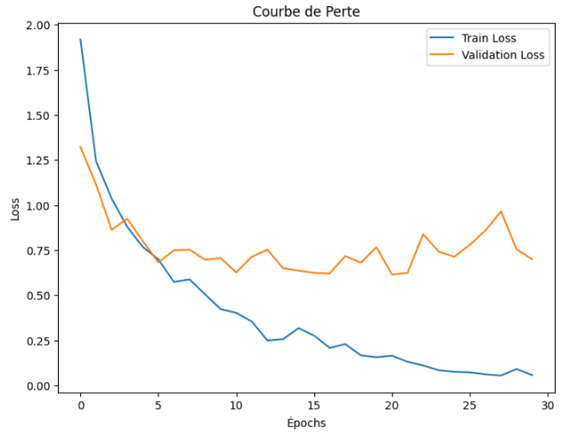
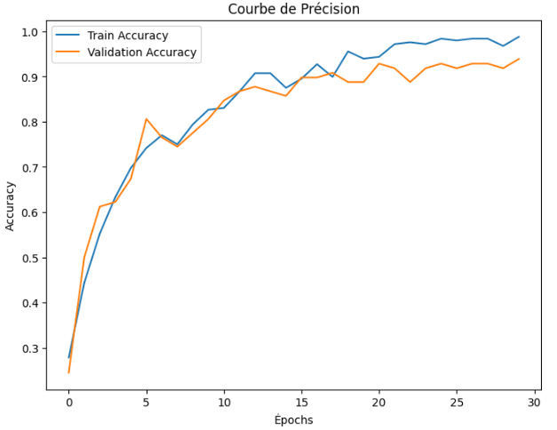

Évaluation des Modèles
======================

Modèles tabulaires
-------------------

Après l'entraînement des modèles, l'étape d'évaluation permet de comparer leurs performances selon différentes métriques. Cette analyse nous a conduits à sélectionner le **modèle Random Forest**, qui a montré la précision (accuracy) la plus élevée.

**Métriques Utilisées**

Les principales métriques d'évaluation des modèles sont :
    1. **Accuracy (Précision globale)** : mesure des prédictions correctes par rapport au total.
    2. **F1-Score** : moyenne harmonique entre précision (precision) et rappel (recall).
    3. **Matrice de Confusion** : tableau de classification montrant les vrais positifs, vrais négatifs, faux positifs, et faux négatifs.
    4. **ROC-AUC** : mesure de la capacité du modèle à discriminer les classes.

**Résultats des Modèles**

Voici les performances des trois premiers modèles évalués individuellement :

1. **Random Forest** :
   - Accuracy : 70.85%
   - Matrice de Confusion :

     .. code-block:: text

        [[1271  180]
         [ 403  146]]

   - Rapport de Classification :
   
     .. code-block:: text

            precision    recall  f1-score
        0       0.76      0.88      0.81
        1       0.45      0.27      0.33

2. **Régression Logistique** :
   - Accuracy : 61.7%
   - Matrice de Confusion :

     .. code-block:: text

        [[888 563]
         [203 346]]

   - Rapport de Classification :
   
     .. code-block:: text

            precision    recall  f1-score
        0       0.81      0.61      0.70
        1       0.38      0.63      0.47

3. **SVM** :
   - Accuracy : 55.1%
   - Matrice de Confusion :

     .. code-block:: text

        [[810 641]
         [257 292]]

   - Rapport de Classification :
   
     .. code-block:: text

            precision    recall  f1-score
        0       0.76      0.56      0.64
        1       0.31      0.53      0.39

Visualisation des Résultats (tabulaire)
----------------------------------------

L'image ci-dessous présente une comparaison en barres des précisions (Accuracy) des trois modèles testés :

.. image:: images/model_accuracy_comparison.png
   :width: 80%
   :alt: Comparaison des accuracy des modèles
   :align: center

*Explication* : Le modèle Random Forest a obtenu la précision la plus élevée, suivie de la Régression Logistique et du modèle SVM.

**Conclusion : Modèle Choisi**

Après évaluation, le **modèle Random Forest** a été sélectionné comme modèle principal pour les raisons suivantes :
- Il a obtenu la précision la plus élevée (70.85%).
- Bien que son rappel pour la classe "blessure musculaire" (1) soit légèrement plus faible que celui des autres modèles, il montre un bon équilibre global en matière de classification.

Modèle CNN
------------

Dans cette section, nous détaillons les performances du modèle CNN sur les données de test, les métriques utilisées et la visualisation des résultats obtenus.

---

**Performances Globales du Modèle**

Après l'entraînement du modèle CNN sur les données d’entraînement et de validation, ses performances ont été évaluées sur l’ensemble de test. Les résultats suivants illustrent l’efficacité du modèle pour la classification des images dans 4 catégories.

**Résultats principaux**

- **Accuracy sur l’ensemble d’entraînement** : **99 %**  
- **Accuracy sur l’ensemble de validation** : **94 %**  
- **Accuracy sur l’ensemble de test** : **93 %**  

Ces valeurs montrent une bonne capacité de généralisation du modèle, avec une légère diminution de l'accuracy sur le test par rapport aux ensembles d'entraînement et de validation, ce qui est un comportement attendu.

---

Le modèle a été évalué à l'aide de la fonction `evaluate` fournie par Keras. Cette fonction calcule la perte et l'accuracy sur un ensemble donné.

.. code-block:: python
   test_loss, test_accuracy = model.evaluate(test_generator)
   print(f"Test Accuracy: {test_accuracy:.2f}")

Visualisation des Résultats (CNN)
----------------------------------

Pour mieux comprendre les performances du modèle, nous avons visualisé les courbes de précision et de perte sur les ensembles d’entraînement et de validation.

**Courbes de Perte**
La courbe de perte suit une tendance décroissante, indiquant que le modèle apprend progressivement à réduire l'erreur entre les prédictions et les valeurs réelles.

.. code-block:: python

   import matplotlib.pyplot as plt

   plt.figure(figsize=(8, 6))
   plt.plot(history.history['loss'], label='Train Loss')
   plt.plot(history.history['val_loss'], label='Validation Loss')
   plt.title('Courbe de Perte')
   plt.xlabel('Épochs')
   plt.ylabel('Loss')
   plt.legend()
   plt.show()

**Courbes de Précision**
Les courbes de précision montrent l'évolution de l’accuracy pour les ensembles d’entraînement et de validation. La différence relativement faible entre les deux indique un modèle bien généralisé.

.. code-block:: python
   plt.figure(figsize=(8, 6))
   plt.plot(history.history['accuracy'], label='Train Accuracy')
   plt.plot(history.history['val_accuracy'], label='Validation Accuracy')
   plt.title('Courbe de Précision')
   plt.xlabel('Épochs')
   plt.ylabel('Accuracy')
   plt.legend()
   plt.show()

- Une précision d’entraînement proche de 99 % suggère un modèle très performant sur les données vues pendant l’entraînement.
- La validation et le test montrent des précisions respectives de 94 % et 93 %, ce qui confirme la robustesse du modèle sur des données non vues.

