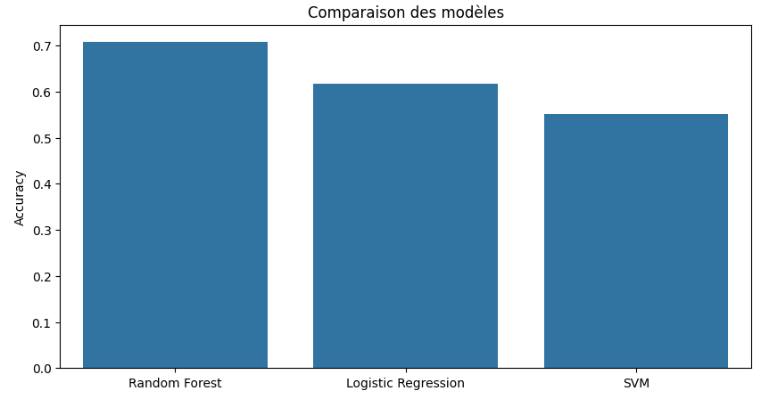

Évaluation des Modèles
======================

Après l'entraînement des modèles, l'étape d'évaluation permet de comparer leurs performances selon différentes métriques. Cette analyse nous a conduits à sélectionner le **modèle Random Forest**, qui a montré la précision (accuracy) la plus élevée.

Métriques Utilisées
-----------------------

Les principales métriques d'évaluation des modèles sont :
    1. **Accuracy (Précision globale)** : mesure des prédictions correctes par rapport au total.
    2. **F1-Score** : moyenne harmonique entre précision (precision) et rappel (recall).
    3. **Matrice de Confusion** : tableau de classification montrant les vrais positifs, vrais négatifs, faux positifs, et faux négatifs.
    4. **ROC-AUC** : mesure de la capacité du modèle à discriminer les classes.

Résultats des Modèles
-------------------------

Voici les performances des trois premiers modèles évalués individuellement :

1. **Random Forest** :
   - Accuracy : 70.85%
   - Matrice de Confusion :

     .. code-block:: text

        [[1271  180]
         [ 403  146]]

   - Rapport de Classification :
   
     .. code-block:: text

            precision    recall  f1-score
        0       0.76      0.88      0.81
        1       0.45      0.27      0.33

2. **Régression Logistique** :
   - Accuracy : 61.7%
   - Matrice de Confusion :

     .. code-block:: text

        [[888 563]
         [203 346]]

   - Rapport de Classification :
   
     .. code-block:: text

            precision    recall  f1-score
        0       0.81      0.61      0.70
        1       0.38      0.63      0.47

3. **SVM** :
   - Accuracy : 55.1%
   - Matrice de Confusion :

     .. code-block:: text

        [[810 641]
         [257 292]]

   - Rapport de Classification :
   
     .. code-block:: text

            precision    recall  f1-score
        0       0.76      0.56      0.64
        1       0.31      0.53      0.39

Visualisation des Résultats
-------------------------------

L'image ci-dessous présente une comparaison en barres des précisions (Accuracy) des trois modèles testés :

*Explication* : Le modèle Random Forest a obtenu la précision la plus élevée, suivie de la Régression Logistique et du modèle SVM.

Conclusion : Modèle Choisi
-----------------------------

Après évaluation, le **modèle Random Forest** a été sélectionné comme modèle principal pour les raisons suivantes :
- Il a obtenu la précision la plus élevée (70.85%).
- Bien que son rappel pour la classe "blessure musculaire" (1) soit légèrement plus faible que celui des autres modèles, il montre un bon équilibre global en matière de classification.
