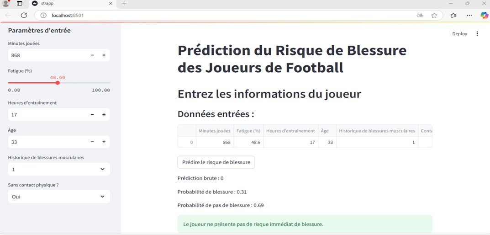
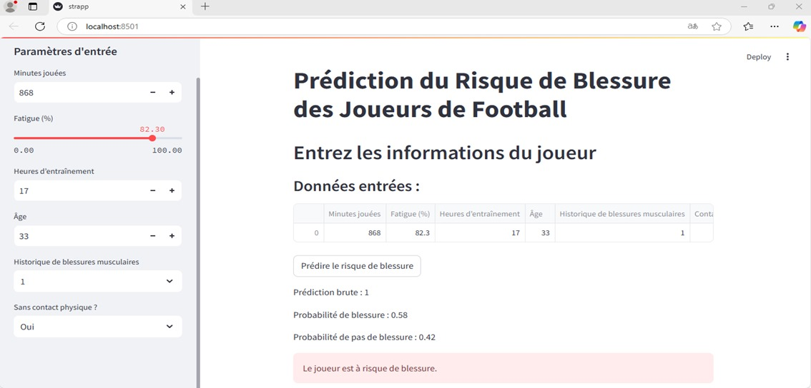

Développement de l'Interface Utilisateur
=========================================

Dans cette étape, une interface utilisateur intuitive a été développée à l'aide de la bibliothèque **Streamlit**, permettant aux utilisateurs de charger des images et de saisir des informations sur les joueurs pour obtenir des prédictions.

**Installation de Streamlit**

Assurez-vous que Streamlit est installé dans votre environnement :

.. code-block:: bash

   pip install streamlit

**Lancer l'interface utilisateur**

Pour démarrer l'application, exécutez la commande suivante dans votre terminal depuis le dossier contenant le fichier `streamlit_app.py` :

.. code-block:: bash

   streamlit run streamlit_app.py

**Fonctionnalités de l'interface**

L'application Streamlit offre les fonctionnalités suivantes :

- Saisie des informations du joueur via des champs interactifs :
    - **Minutes jouées**.
    - **Fatigue (%)**.
    - **Heures d’entraînement**.
    - **Âge**.
    - **Historique de blessures musculaires** (Oui/Non).
    - **Sans contact physique** (Oui/Non).
  
- Visualisation des données saisies sous forme de tableau.
  
- Affichage des prédictions du modèle :
    - Probabilité de blessure musculaire.
    - Interprétation des résultats.

**Exemple de résultat de l'interface**

Une fois que les données sont saisies et soumises, l'utilisateur voit :

- La **prédiction brute** (1 pour un risque de blessure, 0 pour aucun risque).
- Les **probabilités** associées au risque et à l'absence de risque.
- Une alerte intuitive :
    - Rouge pour signaler un risque élevé de blessure.
    - Vert pour indiquer une absence de risque immédiat.

**Capture d'écran de l'interface utilisateur**

Voici une capture d'écran de l'interface :

---

---

**Exemple de code complet**

Le code complet de l'interface utilisateur est disponible ci-dessous :

.. code-block:: python

    import streamlit as st
    import joblib
    import pandas as pd
    import numpy as np

    # Charger le modèle pré-entraîné
    model = joblib.load(r'C:\Users\Dell\Desktop\Projet_IA\modele4_tab.h5')

    # Titre de l'application
    #st.title("Prédiction des Blessures Musculaires")

    ## Interface utilisateur
    st.title("Prédiction du Risque de Blessure des Joueurs de Football")
    st.header("Entrez les informations du joueur")

    # Formulaire pour entrer les données utilisateur
    st.sidebar.header("Paramètres d'entrée")
    minutes_jouees = st.sidebar.number_input("Minutes jouées", min_value=0, step=1, value=1000)
    fatigue = st.sidebar.slider("Fatigue (%)", min_value=0.0, max_value=100.0, value=50.0, step=0.1)
    heures_entrainement = st.sidebar.number_input("Heures d’entraînement", min_value=0, step=1, value=20)
    age = st.sidebar.number_input("Âge", min_value=0, step=1, value=25)
    historique_blessures = st.sidebar.selectbox("Historique de blessures musculaires", [0, 1])
    contact_sans_contact = st.sidebar.selectbox("Sans contact physique ?", ["Oui", "Non"])

    # Conversion du champ 'Sans contact physique ?' en binaire
    contact_physique_encoded = 1 if contact_sans_contact == "Oui" else 0

    # Préparer les données sous forme de dataframe
    data_input = pd.DataFrame({
        "Minutes jouées": [minutes_jouees],
        "Fatigue (%)": [fatigue],
        "Heures d’entraînement": [heures_entrainement],
        "Âge": [age],
        "Historique de blessures musculaires": [historique_blessures],
        "Contact physique_Sans contact": [bool(contact_physique_encoded)]
    })

    st.write("### Données entrées :")
    st.write(data_input)

    # Fonction pour prédire avec scaling
    def predire_risque_blessure(data):
        try:
            prediction = model.predict(data)
            probabilities = model.predict_proba(data)
            return prediction, probabilities
        except ValueError as e:
            st.write(f"Erreur dans la prédiction : {e}")
            return None, None
        

    # Prédiction
    if st.button("Prédire le risque de blessure"):
        prediction, probabilities = predire_risque_blessure(data_input)
        if prediction is not None:
            st.write(f"Prédiction brute : {prediction[0]}")
            st.write(f"Probabilité de blessure : {probabilities[0][1]:.2f}")
            st.write(f"Probabilité de pas de blessure : {probabilities[0][0]:.2f}")

            if prediction[0] == 1:
                st.error("Le joueur est à risque de blessure.")
            else:
                st.success("Le joueur ne présente pas de risque immédiat de blessure.")
        else:
            st.write("Une erreur s'est produite lors de la prédiction.")
