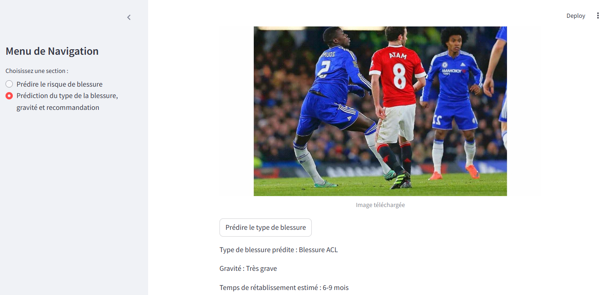

Développement de l'Interface Utilisateur
=========================================

Dans cette étape, une interface utilisateur interactive a été conçue à l'aide de la bibliothèque **Streamlit**. Cette application permet aux utilisateurs de réaliser deux tâches :

1. Prédire le risque de blessure d'un joueur de football en fonction de données tabulaires.
2. Identifier le type de blessure, sa gravité, et estimer le temps de rétablissement à partir d'images.

---

Installation de Streamlit
--------------------------

Avant d'exécuter l'application, assurez-vous que **Streamlit** est installé dans votre environnement :

.. code-block:: bash

   pip install streamlit

---

Lancer l'Interface Utilisateur
-------------------------------

Pour démarrer l'application, exécutez la commande suivante dans votre terminal depuis le dossier contenant le fichier `streamlit_app.py` :

.. code-block:: bash

   streamlit run streamlit_app.py

---

Fonctionnalités de l'Interface
--------------------------------

**Section 1 : Prédiction du Risque de Blessure (Données Tabulaires)**
Cette section de l'interface permet aux utilisateurs de saisir des données concernant le joueur et de prédire le risque de blessure. Les informations demandées incluent :
- **Minutes jouées**.
- **Fatigue (%)**.
- **Heures d’entraînement**.
- **Âge**.
- **Historique de blessures musculaires** (Oui/Non).
- **Sans contact physique** (Oui/Non).

Les résultats incluent :
- Une **prédiction binaire** : risque (1) ou pas de risque (0).
- Les **probabilités associées** au risque et à l'absence de risque.
- Un message intuitif :
  - Rouge : Le joueur est à risque de blessure.
  - Vert : Le joueur ne présente pas de risque immédiat.

**Section 2 : Prédiction du Type de Blessure (Images)**
Cette section utilise un modèle CNN pour identifier le type de blessure en téléchargeant une image. Les fonctionnalités incluent :
- Téléchargement d’une image de la blessure (formats acceptés : JPG, PNG, JPEG).
- Affichage des résultats :
  - **Type de blessure**.
  - **Gravité** (légère, moyenne, grave ou très grave).
  - **Temps estimé de rétablissement**.

---

**Capture d'écran de l'interface utilisateur**

Voici une capture d'écran de l'interface :

.. image:: images/streamlit_interface1.jpg
   :width: 80%
   :alt: Interface Streamlit pour la prédiction des blessures
   :align: center

---

.. image:: images/streamlit_interface2.jpg
   :width: 80%
   :alt: Interface Streamlit pour la prédiction des blessures
   :align: center

---

---

**Code Complet de l'Interface**

.. code-block:: python

    import streamlit as st
    import joblib
    import pandas as pd
    import numpy as np
    from PIL import Image
    import tensorflow as tf

    # Charger les modèles
    tabular_model = joblib.load(r'C:\path\to\modele4_tab.h5')
    image_model = tf.keras.models.load_model(r'C:\path\to\modelcnn.h5')

    # Fonction pour prédire avec le modèle CNN
    def predire_type_blessure(image):
        image = image.resize((150, 150))
        image_array = np.array(image) / 255.0
        image_array = np.expand_dims(image_array, axis=0)
        prediction = image_model.predict(image_array)
        return prediction

    class_mapping = {
        0: ("Blessure ACL", "Très grave", "6-9 mois"),
        1: ("Entorse de la cheville", "Légère", "2-6 semaines"),
        2: ("Lésion", "Grave", "3-6 mois"),
        3: ("Blessure aux Ischio-jambiers", "Moyenne", "4-8 semaines"),
    }

    def interface_tabulaire():
        st.title("Prédiction des Blessures et Recommandations pour les Joueurs")
        st.header("Entrez les informations du joueur")
        
        st.sidebar.header("Paramètres d'entrée")
        minutes_jouees = st.sidebar.number_input("Minutes jouées", min_value=0, step=1, value=1000)
        fatigue = st.sidebar.slider("Fatigue (%)", min_value=0.0, max_value=100.0, step=0.1, value=50.0)
        heures_entrainement = st.sidebar.number_input("Heures d’entraînement", min_value=0, step=1, value=20)
        age = st.sidebar.number_input("Âge", min_value=0, step=1, value=25)
        historique_blessures = st.sidebar.selectbox("Historique de blessures musculaires", [0, 1])
        contact_sans_contact = st.sidebar.selectbox("Sans contact physique ?", ["Oui", "Non"])
        
        contact_physique_encoded = 1 if contact_sans_contact == "Oui" else 0
        
        data_input = pd.DataFrame({
            "Minutes jouées": [minutes_jouees],
            "Fatigue (%)": [fatigue],
            "Heures d’entraînement": [heures_entrainement],
            "Âge": [age],
            "Historique de blessures musculaires": [historique_blessures],
            "Contact physique_Sans contact": [contact_physique_encoded],
        })
        
        st.write("### Données entrées :")
        st.write(data_input)
        
        if st.button("Prédire le risque de blessure"):
            try:
                prediction = tabular_model.predict(data_input)
                probabilities = tabular_model.predict_proba(data_input)
                
                st.write(f"Probabilité de blessure : {probabilities[0][1]:.2f}")
                st.write(f"Probabilité de pas de blessure : {probabilities[0][0]:.2f}")
                
                if prediction[0] == 1:
                    st.error("Le joueur est à risque de blessure.")
                else:
                    st.success("Pas de risque immédiat de blessure.")
            except Exception as e:
                st.error(f"Erreur lors de la prédiction : {e}")

    def interface_images():
        st.title("Prédiction du Type de Blessure et Durée de Rétablissement")
        
        uploaded_file = st.file_uploader("Téléchargez une image", type=["jpg", "png", "jpeg"])
        if uploaded_file:
            image = Image.open(uploaded_file)
            st.image(image, caption="Image téléchargée")
            
            if st.button("Prédire le type de blessure"):
                prediction = predire_type_blessure(image)
                predicted_class = np.argmax(prediction)
                blessure, gravité, délai = class_mapping[predicted_class]
                st.write(f"Type de blessure : {blessure}")
                st.write(f"Gravité : {gravité}")
                st.write(f"Temps de rétablissement estimé : {délai}")

    option = st.sidebar.radio("Menu :", ["Risque de Blessure", "Type de Blessure"])
    if option == "Risque de Blessure":
        interface_tabulaire()
    elif option == "Type de Blessure":
        interface_images()

---

**Conclusion**  
Cette interface simple et intuitive permet d'exploiter les modèles entraînés pour prédire des risques ou analyser des blessures, et offre une expérience utilisateur conviviale adaptée aux entraîneurs ou au personnel médical.
